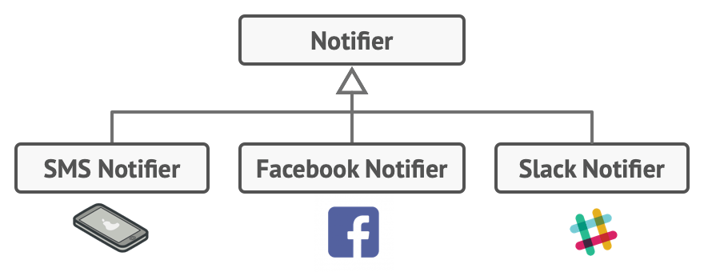

# Decorator

<!-- vim-markdown-toc Marked -->

* [Intent](#intent)
* [Problem](#problem)
* [Solution](#solution)

<!-- vim-markdown-toc -->

## Intent

**Decorator** is a structural design pattern that lets you attach new behaviors 
to objects by placing these objects inside special wrapper objects that contain 
the behaviors.

## Problem

Imagine that you're working on a notification library which lets
other programs notify their users about important events.

The initial version of the library was based on the `Notifier` 
class that had only a few fields, a constructor and a single 
`send` method. The method could accept a message argument from
a client and send the message to a list of emails that were passed
to the notifier via its constructor. A third-party app which acted
as a client was supposed to create and configure the notifier object
once, and use it each time something important happened.

A program could use the notifier class to send notifications about
important events to a predefined set of emails.

At some point, you realize that users of the library expect more
than just email notifications. Many of them would like to receive
SMS about critical issues. Others would like to be notified on 
Facebook and, of course, the corporate users would love to get Slack notifications.

Each notification type is implemented as a notifier's subclass.

How hard can that be? You extended the `Notifier` class and put the additional 
notification methods into the new subclasses. Now the client was supposed to 
intantiate the disired notification class and use it for all further 
notifications.

But then someone reasonably asked you, "Why cann't you use several notification
types at once? If your house is on fire, you'd probably want to be informed 
through every channel."

You tried to address that problem by creating special subclasses which combined
several notification methods within one class. However,it quickly became 
apparent that this approach would bloat the code immensely,not only the library
code but the client code as well.

You have to find some other way to structure the notifactions classes so that 
their number won't accidently break some Guinness record.

## Solution
Extending a class is the first thing that comes to your mind when you need to 
alter an object's behavior. However, inheritance has several serious caveats 
that you need to be aware of.

- Inheritance is static. You can't alter the behavior of an existing object at 
runtime. You can only replace the whole object with another one that's created
from a different subclass.

- Subclass can have just one parent class. In most languages,inheritance doesn't
let a class inherit behaviors of multiple classes as the same time.
